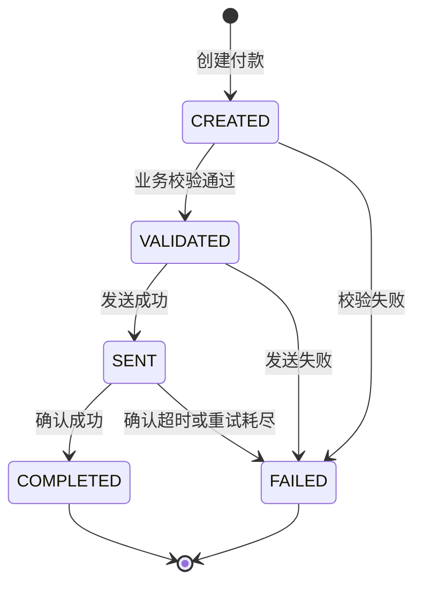
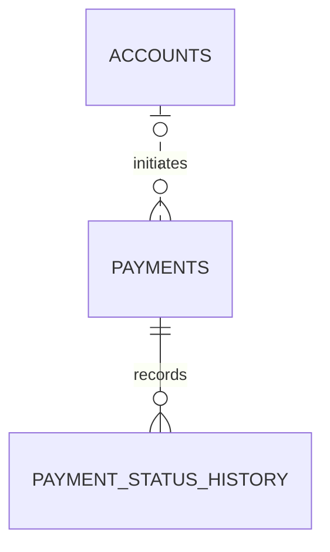

# MidnightBuilders Payment Processing System

一个基于 Spring Boot 的付款处理系统，覆盖付款创建、业务校验、状态流转、外部处理模拟、失败重试和审计历史查询。项目同时提供 REST API 和随 Spring Boot 发布的静态管理页面。

## 功能概览

- 使用 `Idempotency-Key` 幂等创建付款，避免同一请求被重复提交
- 校验金额、币种、账户格式和付款方账户状态
- 通过状态机限制合法状态流转
- 模拟付款发送、网络延迟、超时和重试
- 保存付款当前状态及每一次状态变化的审计记录
- 按状态筛选付款并查询单笔付款详情和完整历史
- 使用 Flyway 管理数据库结构和演示账户数据
- 使用 H2 运行自动化测试，使用 MySQL 作为本地运行数据库

## 付款生命周期



`COMPLETED` 和 `FAILED` 是终态，不能继续处理。每次状态变化都会写入 `payment_status_history`。

## 技术栈

- Java 17
- Spring Boot 4.1
- Spring Web、Bean Validation、Spring Data JPA
- MySQL 8.4
- Flyway
- Maven Wrapper
- JUnit 5、H2、Mockito
- HTML、CSS、原生 JavaScript

## 数据模型



- `payment_status_history.payment_id` 是指向 `payments.id` 的真实外键。
- `payments.source_account` 由应用按 `accounts.account_number` 查询，目前没有数据库外键。
- `destination_account` 可以是外部账户，因此不要求存在于 `accounts`。

数据库迁移位于 `demo1/src/main/resources/db/migration`：

- V1：创建 `payments`
- V2：创建 `payment_status_history`
- V3：创建 `accounts`
- V4：写入演示账户
- V5：扩展账户类型、币种、状态和乐观锁版本

## 项目结构

```text
MidnightBuilders/
├── demo1/
│   ├── src/main/java/com/example/demo/
│   │   ├── controller/       REST API
│   │   ├── service/          业务编排、校验、状态流转和处理模拟
│   │   ├── statemachine/     付款状态机
│   │   ├── entity/           JPA 实体
│   │   ├── repository/       数据访问层
│   │   ├── dto/              请求、响应及内部 DTO
│   │   └── exception/        业务异常及统一异常响应
│   ├── src/main/resources/
│   │   ├── db/migration/     Flyway 迁移
│   │   └── static/           管理页面
│   └── src/test/             单元测试和集成测试
├── docs/                     需求、架构、API 和数据库文档
├── docker-compose.yml        本地 MySQL
└── .env.example              Docker 环境变量示例
```

## 本地启动

### 前置条件

- Git
- Java 17 或更高版本
- Docker Desktop 或兼容的 Docker 环境

不需要预先安装 Maven，项目已包含 Maven Wrapper。

### 1. 克隆项目

```bash
git clone git@github.com:Neueda-Learning/MidnightBuilders.git
cd MidnightBuilders
```

### 2. 启动 MySQL

macOS、Linux：

```bash
cp .env.example .env
docker compose up -d mysql
docker compose ps
```

Windows PowerShell：

```powershell
Copy-Item .env.example .env
docker compose up -d mysql
docker compose ps
```

容器内 MySQL 使用 `3306`，项目的 Docker Compose 将它映射到主机的 `8081`。

### 3. 启动应用

macOS、Linux：

```bash
cd demo1

DB_URL='jdbc:mysql://localhost:8081/payment_processing?createDatabaseIfNotExist=true&useSSL=false&allowPublicKeyRetrieval=true&serverTimezone=UTC' \
DB_USERNAME='payment_user' \
DB_PASSWORD='payment_pass' \
./mvnw spring-boot:run
```

Windows PowerShell：

```powershell
Set-Location demo1
$env:DB_URL = 'jdbc:mysql://localhost:8081/payment_processing?createDatabaseIfNotExist=true&useSSL=false&allowPublicKeyRetrieval=true&serverTimezone=UTC'
$env:DB_USERNAME = 'payment_user'
$env:DB_PASSWORD = 'payment_pass'
.\mvnw.cmd spring-boot:run
```

启动完成后访问：

- 管理页面：<http://localhost:8080/>
- API 根路径：<http://localhost:8080/api/payments>

Flyway 会在应用启动时自动创建和升级数据库表，并写入以下付款方演示账户：

- `ACC-SOURCE-01`
- `ACC-CN-001`
- `ACC001`

## API

| 方法 | 路径 | 说明 |
|---|---|---|
| `POST` | `/api/payments` | 创建付款，需要 `Idempotency-Key` 请求头 |
| `GET` | `/api/payments/{id}` | 查询付款详情 |
| `GET` | `/api/payments` | 查询全部付款，按创建时间倒序 |
| `GET` | `/api/payments?status={status}` | 按状态筛选付款 |
| `POST` | `/api/payments/{id}/process` | 处理付款并推进状态 |
| `GET` | `/api/payments/{id}/history` | 查询状态变化历史 |

支持的状态为：`CREATED`、`VALIDATED`、`SENT`、`COMPLETED`、`FAILED`。

### 创建付款

```bash
curl --request POST 'http://localhost:8080/api/payments' \
    --header 'Content-Type: application/json' \
    --header 'Idempotency-Key: demo-payment-001' \
    --data '{
        "sourceAccount": "ACC-SOURCE-01",
        "destinationAccount": "EXT-DEST-001",
        "amount": 125.50,
        "currency": "CNY",
        "reference": "Demo payment"
    }'
```

首次创建返回 `201 Created`。使用相同幂等键和相同请求体重放时返回已有付款；相同幂等键配合不同请求体会产生幂等冲突。

### 处理付款

将 `{paymentId}` 替换为创建接口返回的 `id`：

```bash
curl --request POST \
    'http://localhost:8080/api/payments/{paymentId}/process'
```

处理过程会依次执行账户和业务校验、发送、确认及网络重试。默认模拟延迟为 0–20 秒，单次超时为 10 秒，最大重试次数为 3。

### 查询付款和历史

```bash
curl 'http://localhost:8080/api/payments'

curl 'http://localhost:8080/api/payments?status=COMPLETED'

curl 'http://localhost:8080/api/payments/{paymentId}'

curl 'http://localhost:8080/api/payments/{paymentId}/history'
```

## 配置

应用支持通过环境变量覆盖数据库连接：

| 环境变量 | 说明 |
|---|---|
| `DB_URL` | JDBC 数据库地址 |
| `DB_USERNAME` | 数据库用户名 |
| `DB_PASSWORD` | 数据库密码 |

处理模拟配置位于 `application.properties`：

| 配置项 | 默认值 | 说明 |
|---|---:|---|
| `payment.simulation.min-delay-seconds` | `0` | 最小模拟延迟 |
| `payment.simulation.max-delay-seconds` | `20` | 最大模拟延迟 |
| `payment.simulation.timeout-seconds` | `10` | 单次确认超时 |
| `payment.simulation.max-retries` | `3` | 最大重试次数 |

## 运行测试

测试默认使用内存 H2 数据库，不需要启动 MySQL：

macOS、Linux：

```bash
cd demo1
./mvnw test
```

Windows PowerShell：

```powershell
Set-Location demo1
.\mvnw.cmd test
```

测试覆盖控制器、校验、幂等、状态流转、历史记录、网络重试、Repository 和 Flyway Schema。

## 停止本地环境

停止 MySQL 并保留数据：

```bash
docker compose down
```

如果明确需要同时删除本地数据库卷，可执行：

```bash
docker compose down --volumes
```

第二条命令会永久删除 Docker 卷中的本地数据库数据。

## 延伸文档

- `docs/api-design.md`：接口设计
- `docs/database-design.md`：数据库设计
- `docs/architecture.md`：系统架构
- `docs/payment-state-flow.md`：付款状态流
- `docs/git-workflow.md`：团队 Git 工作流
