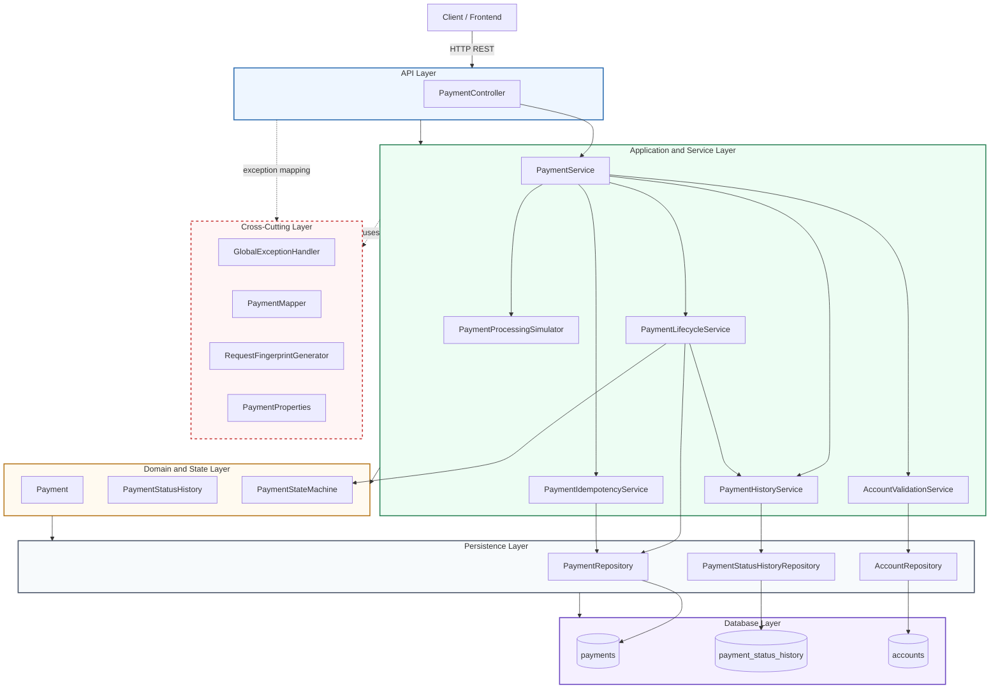
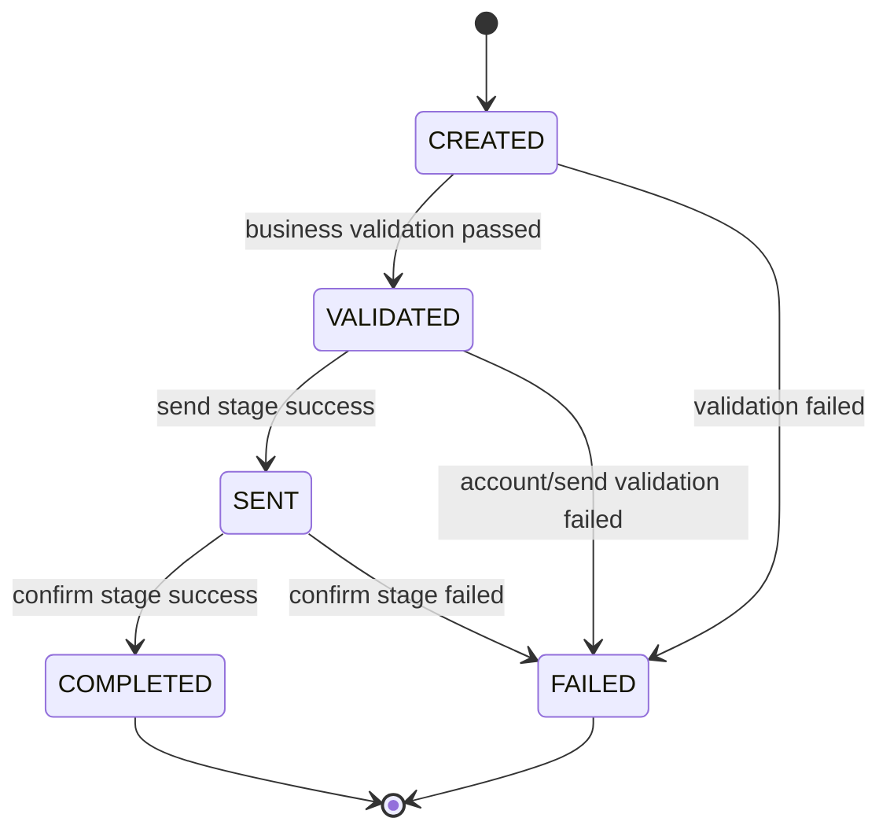
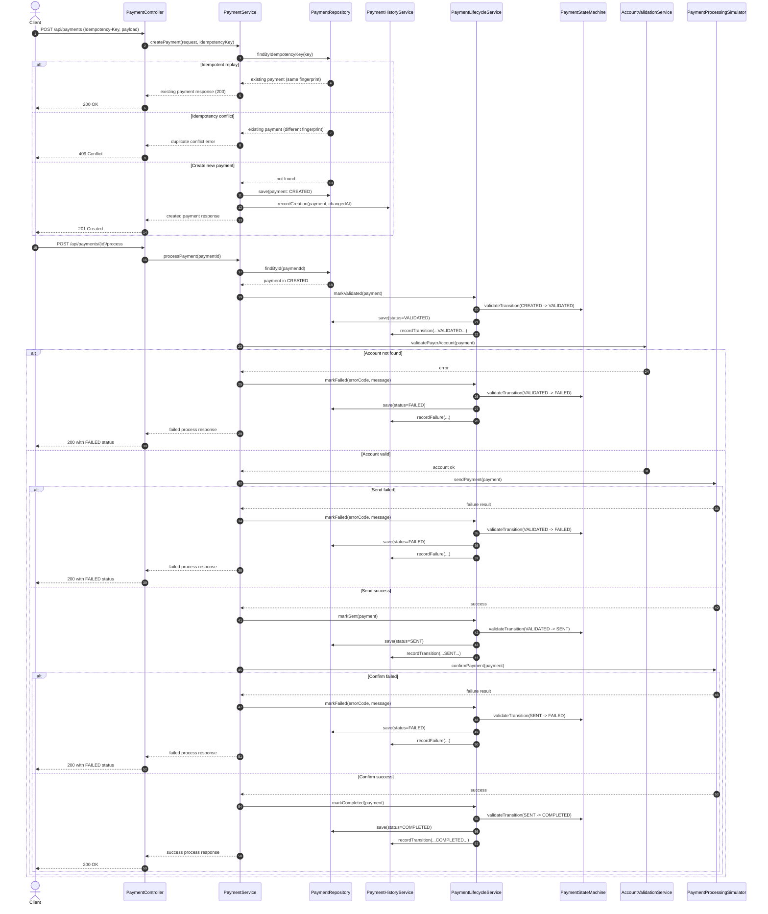

# High-Level Architecture

## 1. Purpose and Scope

This document describes the high-level architecture of the `payment-processing` service in this repository.

The current scope focuses on payment lifecycle management for these API capabilities:
- Create payment (`POST /api/payments`)
- Get payment by ID (`GET /api/payments/{id}`)
- List payments (`GET /api/payments`)
- Process payment (`POST /api/payments/{id}/process`)
- Get payment history (`GET /api/payments/{id}/history`)

Out of scope for this iteration:
- Real external settlement integration (currently simulated)
- Authentication/authorization gateway integration
- Event streaming or asynchronous orchestration

## 2. Architecture Style

The system follows a layered monolith style built with Spring Boot:
- Presentation layer: REST endpoints and request/response binding
- Application/service layer: orchestration and business workflows
- Domain and state layer: payment state transition rules and entities
- Persistence layer: Spring Data JPA repositories
- Infrastructure layer: database migration, runtime configuration, and logging

This structure favors clarity, transactional consistency, and easy local development.

### 2.1 Mermaid System Architecture Diagram

This diagram shows the layered monolith boundaries and how API requests flow into orchestration services, then to state logic and persistence.

## 3. Core Modules and Responsibilities

### 3.1 API Layer
- `src/main/java/com/example/demo/controller/PaymentController.java`
- Accepts HTTP requests, validates request shapes, reads `Idempotency-Key`, and returns HTTP responses.
- Delegates all business operations to `PaymentService`.

### 3.2 Orchestration and Business Services
- `src/main/java/com/example/demo/service/PaymentService.java`
- Central orchestration point for create/read/list/process/history operations.
- Coordinates validation, idempotency checks, lifecycle transitions, history recording, and response mapping.

Related services:
- `src/main/java/com/example/demo/service/PaymentLifecycleService.java`
  - Single write path for status transitions.
  - Enforces transition validity with `PaymentStateMachine`.
  - Persists status changes and writes history in the same transaction.
- `src/main/java/com/example/demo/service/PaymentHistoryService.java`
  - Writes immutable status history records.
  - Reads timeline history for API responses.
- `src/main/java/com/example/demo/service/PaymentIdempotencyService.java`
  - Implements key validation and replay/conflict decisions.
  - Includes concurrent duplicate handling strategy.
- `src/main/java/com/example/demo/service/AccountValidationService.java`
  - Verifies source account existence via account repository.
- `src/main/java/com/example/demo/service/PaymentProcessingSimulator.java`
  - Simulates external send/confirm steps and maps failures to stable error codes.

### 3.3 Domain and State Rules
- `src/main/java/com/example/demo/entity/Payment.java`
  - Core payment aggregate-like record.
  - Holds idempotency key, request fingerprint, status, and failure details.
- `src/main/java/com/example/demo/entity/PaymentStatusHistory.java`
  - Immutable audit trail of status transitions.
- `src/main/java/com/example/demo/statemachine/PaymentStateMachine.java`
  - Central transition table for legal status moves.

Current state graph:
- `CREATED -> VALIDATED -> SENT -> COMPLETED`
- `CREATED|VALIDATED|SENT -> FAILED`
- `COMPLETED` and `FAILED` are terminal states.

### 3.3.1 Mermaid Payment Lifecycle State Diagram

This block diagram focuses on allowed state transitions only; execution details are shown in the sequence diagram.

### 3.4 Persistence Layer
- `src/main/java/com/example/demo/repository/PaymentRepository.java`
- `src/main/java/com/example/demo/repository/PaymentStatusHistoryRepository.java`
- `src/main/java/com/example/demo/repository/AccountRepository.java`

Uses Spring Data JPA against MySQL in runtime and H2 in tests.

### 3.5 Error Handling
- `src/main/java/com/example/demo/exception/GlobalExceptionHandler.java`
- Converts business/runtime/validation exceptions into a standard `ErrorResponse` payload.
- Maps known error codes to appropriate HTTP statuses.

## 4. Request and Processing Flow

### 4.0 Mermaid Processing Sequence Diagram

This sequence diagram illustrates both create-time idempotency paths and process-time state transitions with history persistence.

### 4.1 Create Payment Flow
1. `PaymentController.createPayment` receives request + `Idempotency-Key`.
2. `PaymentService` normalizes and validates request fields.
3. Service checks idempotency using key + request fingerprint.
4. If replay, return existing payment.
5. If conflict, return duplicate/conflict error.
6. If create allowed, persist `Payment` with status `CREATED`.
7. Record initial `PaymentStatusHistory` entry.

### 4.2 Process Payment Flow
1. `PaymentController.processPayment` calls `PaymentService.processPayment`.
2. Service verifies payment exists and is in `CREATED` state.
3. Transition to `VALIDATED` through `PaymentLifecycleService`.
4. Validate payer account existence.
5. Simulator executes send stage; on success transition to `SENT`.
6. Simulator executes confirm stage; on success transition to `COMPLETED`.
7. Any failure in business checks, account checks, or simulator stages transitions to `FAILED` with error metadata.
8. Every transition is recorded to history.

## 5. Data Model Overview

### 5.1 `payments`
Main columns include:
- `id` (UUID string primary key)
- `source_account`, `destination_account`
- `amount`, `currency`, `reference`
- `status`
- `idempotency_key` (unique)
- `request_fingerprint`
- `error_code`, `error_message`
- `created_at`, `updated_at`

Key properties:
- Idempotency is protected by database uniqueness on `idempotency_key`.
- Status-based querying is optimized with an index.
- Failure metadata is captured directly on payment for current-state visibility.

### 5.2 `payment_status_history`
Main columns include:
- `id` (UUID string primary key)
- `payment_id` (foreign-key-like reference)
- `from_status`, `to_status`
- `triggered_by`
- `error_code`, `notes`
- `changed_at`

Key properties:
- Immutable append-only audit timeline.
- Indexed by `payment_id` and timestamp for ordered retrieval.

### 5.3 `accounts`
- Local account master table used by `AccountValidationService`.
- Seeded demo data via Flyway migration.

## 6. Transaction and Consistency Model

- Business orchestration methods in `PaymentService` use `@Transactional` where needed.
- `PaymentLifecycleService` methods are transactional and act as the only status mutation path.
- Payment status updates and history writes are committed atomically to avoid mismatch.
- Concurrent create requests are handled by combining pre-check logic and database unique constraints.

## 7. Configuration and Environments

### 7.1 Runtime Configuration
- `src/main/resources/application.properties`
- Configures datasource, Flyway, JPA behavior, and logging levels.

### 7.2 Typed Business Config
- `src/main/java/com/example/demo/config/PaymentProperties.java`
- Binds `payment.*` properties for business rules such as:
  - max amount
  - supported currencies
  - account format bounds
  - idempotency key max length

### 7.3 Database Migration
- `src/main/resources/db/migration/V1__create_payments_table.sql`
- `src/main/resources/db/migration/V2__create_payment_status_history_table.sql`
- `src/main/resources/db/migration/V3__create_accounts_table.sql`
- `src/main/resources/db/migration/V4__seed_demo_accounts.sql`

Flyway is the schema source of truth for structure and seed evolution.

## 8. Observability and Operational Signals

Current observability baseline:
- Structured service/controller logs with masked sensitive values where applicable.
- Error logs with stack traces for unexpected failures.
- History table acts as an audit-friendly operational timeline.

Potential next-step enhancements:
- Add distributed tracing and request correlation IDs.
- Add metrics for transition counts, failure codes, and processing latency.
- Add health/readiness checks for database and migration status.

## 9. Security and Data Protection

Current controls:
- Input validation at API boundary (`jakarta.validation` and service-level checks).
- Basic sensitive-data masking in logs for idempotency key and account values.

Gaps to address in future iterations:
- Authentication and authorization for API access.
- Secrets management hardening for datasource credentials.
- Rate limiting and abuse protection.
- PII data classification and retention policy.

## 10. Deployment and Scalability

Deployment profile:
- Single Spring Boot service, stateless at application layer.
- Backed by relational database with Flyway-managed schema.

Scalability characteristics:
- Horizontal scaling is feasible because state is persisted in database.
- Idempotency correctness relies on shared DB uniqueness guarantees.
- For higher throughput, consider async processing and queue-backed orchestration.

## 11. Test Strategy Snapshot

Current tests cover multiple levels under `src/test/java/com/example/demo`:
- Controller integration (`PaymentControllerIntegrationTest`)
- Service behavior and lifecycle transitions
- Repository behavior
- Mapper and utility units
- Flyway migration and schema validation

Recommended additions:
- Contract tests for error payload stability.
- Concurrency tests for idempotency race conditions.
- Performance smoke tests for list/history queries at scale.

## 12. Architecture Decisions and Trade-Offs

- Chosen synchronous orchestration for iteration simplicity and debuggability.
- Kept lifecycle transitions centralized to reduce scattered state mutation bugs.
- Used DB unique index as the final idempotency guard in concurrent scenarios.
- Used simulator boundary to defer external dependency complexity.

## 13. Future Evolution Path

Short-term:
- Move all business validation constants in `PaymentService` fully to `PaymentProperties`.
- Align exception taxonomy so all business failures use a single domain exception model.
- Introduce request correlation IDs in logs and responses.

Mid-term:
- Replace simulator with real external adapter(s).
- Add outbox/event publication for downstream integrations.
- Add authn/authz and stronger operational SLO monitoring.

