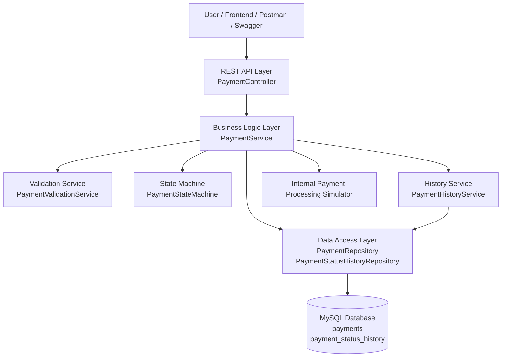
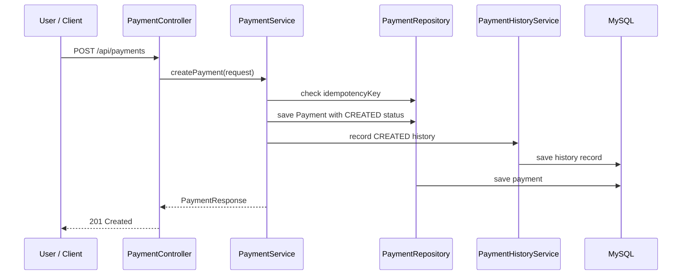
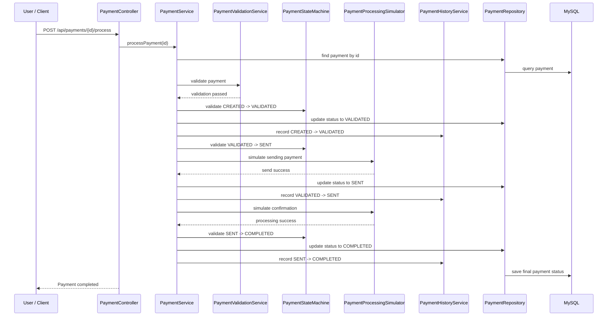
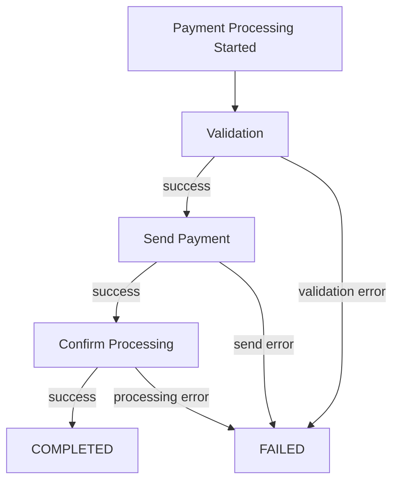

# Payment Processing System - Architecture Design

> Source of truth: if any detail conflicts with iteration docs, follow `docs/iteration1/01-project-structure.md` and `docs/iteration1/02-backend-method-design.md`.

## 1. 文档说明

本文档描述 Payment Processing System 的系统架构设计。

本项目使用：

- Java Spring Boot 作为后端框架；
- MySQL 作为数据库；
- REST API 作为系统对外接口；
- 前端页面、Postman 或 Swagger 作为 API 调用入口。

系统的核心目标是管理付款从创建、校验、发送，到完成或失败的完整生命周期。

项目第一版不接入真实银行支付网络，付款处理过程由系统内部模拟完成。

---

# 2. Architecture Overview

系统采用典型的分层架构：

```text
Frontend / Postman / Swagger
            |
            v
REST API Layer
            |
            v
Business Logic Layer
            |
            v
Data Access Layer
            |
            v
MySQL Database
```

---

# 3. System Architecture Diagram



---

# 4. Layer Responsibilities

## 4.1 Frontend / API Client Layer

调用系统 API 的入口。

第一版可以使用：

- Postman；
- Swagger UI；
- 简单前端页面。

主要功能：

- 创建付款；
- 查看付款列表；
- 查看付款详情；
- 查看付款状态历史；
- 查看失败原因。

---

## 4.2 REST API Layer

对应 Spring Boot 中的 Controller 层。

主要组件：

```text
PaymentController
```

职责：

- 接收 HTTP 请求；
- 解析请求参数；
- 调用 Service 层；
- 返回 HTTP Response；
- 不直接处理复杂业务逻辑；
- 不直接访问数据库。

示例 API：

```http
POST /api/payments
GET /api/payments/{id}
GET /api/payments
POST /api/payments/{id}/process
GET /api/payments/{id}/history
```

---

## 4.3 Business Logic Layer

对应 Spring Boot 中的 Service 层。

这是系统最核心的一层。

主要组件：

```text
PaymentService
PaymentValidationService
PaymentStateMachine
PaymentHistoryService
PaymentProcessingSimulator
```

职责：

- 创建付款；
- 校验付款；
- 控制付款状态流转；
- 模拟付款处理；
- 记录状态历史；
- 处理业务异常；
- 防止非法状态转换；
- 防止重复付款请求。

---

## 4.4 Data Access Layer

对应 Spring Boot 中的 Repository 层。

主要组件：

```text
PaymentRepository
PaymentStatusHistoryRepository
```

职责：

- 保存 Payment；
- 查询 Payment；
- 根据状态筛选 Payment；
- 根据 idempotencyKey 查询 Payment；
- 保存状态历史；
- 查询某笔付款的所有历史记录。

Repository 层只负责数据库访问，不处理业务规则。

---

## 4.5 Database Layer

数据库使用 MySQL。

核心表：

```text
payments
payment_status_history
```

## payments 表

保存付款当前状态和基本信息。

主要字段：

```text
id
source_account
destination_account
amount
currency
reference
status
idempotency_key
error_code
error_message
created_at
updated_at
```

## payment_status_history 表

保存付款状态变化历史。

主要字段：

```text
id
payment_id
from_status
to_status
triggered_by
error_code
notes
changed_at
```

一笔 Payment 可以有多条 Payment Status History。

关系：

```text
payments 1 ---- N payment_status_history
```

---

# 5. Payment Processing Flow

## 5.1 Create Payment Flow



说明：

1. 用户提交付款请求；
2. 系统检查 idempotencyKey；
3. 系统创建 Payment；
4. 初始状态为 CREATED；
5. 系统写入第一条状态历史；
6. 返回创建成功结果。

---

## 5.2 Process Payment Flow



---

# 6. Failure Flow

失败可能发生在三个阶段：

```text
CREATED -> FAILED
VALIDATED -> FAILED
SENT -> FAILED
```

失败时系统需要：

1. 将 Payment 状态更新为 FAILED；
2. 保存 errorCode；
3. 保存 errorMessage；
4. 写入 payment_status_history；
5. 返回统一错误响应。

失败流程：



---

# 7. Idempotency Architecture

## Purpose

Idempotency 用于防止客户端重复提交同一笔付款。

例如：

客户端第一次请求：

```http
POST /api/payments
Idempotency-Key: request-001
```

系统创建：

```text
Payment P001
```

客户端因为网络问题再次提交相同请求：

```http
POST /api/payments
Idempotency-Key: request-001
```

系统应该返回已有的 Payment P001，而不是创建新的 Payment P002。

## Implementation Idea

系统在 `payments` 表中保存：

```text
idempotency_key
```

并设置唯一约束：

```text
UNIQUE(idempotency_key)
```

创建付款时：

```text
1. 先根据 idempotencyKey 查询 Payment
2. 如果存在，返回已有 Payment
3. 如果不存在，创建新 Payment
```

---

# 8. Exception Handling Architecture

系统使用统一异常处理。

主要组件：

```text
GlobalExceptionHandler
ErrorResponse
```

统一错误格式：

```json
{
  "timestamp": "2026-07-25T10:00:00",
  "status": 400,
  "errorCode": "INVALID_AMOUNT",
  "message": "Amount must be greater than zero",
  "path": "/api/payments"
}
```

常见错误码：

| Error Code | HTTP Status | Description |
|---|---:|---|
| INVALID_AMOUNT | 400 | 金额非法 |
| INVALID_CURRENCY | 400 | 不支持的币种 |
| INVALID_ACCOUNT | 400 | 账户非法 |
| DUPLICATE_PAYMENT | 409 | 重复付款 |
| INVALID_STATUS_TRANSITION | 400 | 非法状态转换 |
| PAYMENT_NOT_FOUND | 404 | Payment 不存在 |
| PROCESSING_ERROR | 500 | 系统处理错误 |

---

# 9. Suggested Spring Boot Package Structure

建议项目代码结构如下：

```text
src/main/java/com/example/demo

├── controller
│   └── PaymentController.java
│
├── service
│   ├── PaymentService.java
│   ├── PaymentValidationService.java
│   ├── PaymentIdempotencyService.java
│   ├── PaymentLifecycleService.java
│   ├── PaymentHistoryService.java
│   └── PaymentProcessingSimulator.java
│
├── statemachine
│   └── PaymentStateMachine.java
│
├── repository
│   ├── PaymentRepository.java
│   └── PaymentStatusHistoryRepository.java
│
├── entity
│   ├── Payment.java
│   └── PaymentStatusHistory.java
│
├── dto
│   ├── request/
│   │   └── CreatePaymentRequest.java
│   └── response/
│       ├── PaymentResponse.java
│       ├── PaymentListItemResponse.java
│       ├── ProcessPaymentResponse.java
│       ├── PaymentHistoryResponse.java
│       └── ErrorResponse.java
│
├── enums
│   ├── PaymentStatus.java
│   └── PaymentErrorCode.java
│
├── mapper
│   └── PaymentMapper.java
│
├── config
│   ├── ClockConfig.java
│   └── PaymentProperties.java
│
├── util
│   └── RequestFingerprintGenerator.java
│
└── exception
    ├── BusinessException.java
    ├── PaymentNotFoundException.java
    ├── DuplicatePaymentException.java
    ├── InvalidStatusTransitionException.java
    └── GlobalExceptionHandler.java
```

---

# 10. Request Lifecycle Example

以创建付款为例：

```text
User
  ↓
PaymentController
  ↓
PaymentService
  ↓
PaymentRepository
  ↓
MySQL
```

以处理付款为例：

```text
User
  ↓
PaymentController
  ↓
PaymentService
  ↓
PaymentValidationService
  ↓
PaymentStateMachine
  ↓
PaymentProcessingSimulator
  ↓
PaymentHistoryService
  ↓
PaymentRepository
  ↓
MySQL
```

---

# 11. Transaction Design

付款处理涉及多次状态更新和历史记录写入。

为了保证数据一致性，建议在 Service 层使用事务。

例如：

```text
processPayment()
```

应该保证：

- Payment 状态更新成功；
- 对应 History 记录也保存成功；
- 如果中间发生异常，数据库操作可以回滚。

在 Spring Boot 中可以使用：

```java
@Transactional
```

建议放在：

```text
PaymentService.processPayment()
PaymentService.createPayment()
```

---

# 12. Design Principles

本系统架构遵循以下原则：

## 12.1 Controller 只处理 HTTP

Controller 不写复杂业务逻辑。

它只负责：

```text
接收请求
调用 Service
返回响应
```

---

## 12.2 Service 处理业务逻辑

Service 层负责：

```text
付款创建
付款校验
付款处理
状态变化
历史记录
```

---

## 12.3 Repository 只访问数据库

Repository 不应该判断业务规则。

它只负责：

```text
save
findById
findAll
findByStatus
findByIdempotencyKey
```

---

## 12.4 状态变化必须经过 State Machine

不允许在不同地方随便修改状态。

所有状态变化都应该经过：

```text
PaymentStateMachine
```

---

## 12.5 每次状态变化必须写入 History

状态变化必须同时记录到：

```text
payment_status_history
```

用于审计和问题排查。

---

# 13. MVP Architecture Scope

第一版只实现：

- Payment 创建；
- Payment 查询；
- Payment 列表；
- 按状态筛选；
- Payment 处理；
- 状态历史查询；
- 失败原因记录；
- 幂等性处理；
- MySQL 持久化。

第一版不实现：

- 用户登录；
- 权限控制；
- 真实银行网络；
- 真实账户余额扣减；
- 外汇兑换；
- 批量付款；
- 定时付款；
- 报表系统。

---

# 14. Future Architecture Extension

未来可以扩展：

| Feature | Possible Component |
|---|---|
| 前端页面 | React / Vue / Angular |
| 批量付款 | BatchPaymentService |
| 定时付款 | PaymentScheduler |
| 通知 | NotificationService |
| 报表 | ReportingService |
| 真实账户 | AccountService |
| 真实外部系统 | ExternalPaymentGatewayClient |
| 并发控制 | Optimistic Locking / Version Field |

---

# 15. Summary

Payment Processing System 使用分层架构：

```text
Client
  ↓
Controller
  ↓
Service
  ↓
Repository
  ↓
MySQL
```

系统核心业务逻辑集中在 Service 层。

其中最重要的设计点是：

- Payment 生命周期管理；
- Payment 状态机；
- Payment 状态历史记录；
- MySQL 持久化；
- 幂等性处理；
- 统一错误响应。

该架构适合第一版 MVP，也方便后续扩展前端、批量付款、通知和报表等功能。
