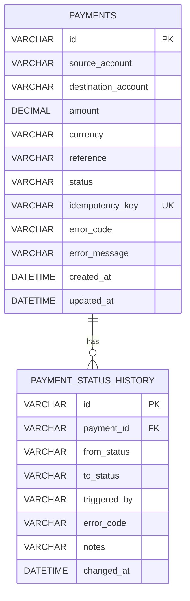

# Payment Processing System - Database Design

## 1. 数据库设计说明

本系统使用 MySQL 作为数据存储。

数据库设计围绕 Payment 生命周期展开。

核心设计原则：

1. Payment 表保存当前付款状态；
2. Payment Status History 表保存所有状态变化记录；
3. 一个 Payment 可以拥有多条状态历史记录；
4. 状态历史用于 Audit Trail（审计追踪）。

---

# 2. ERD 数据关系图



---

# 3. Table Design

# 3.1 payments 表

## Purpose

保存付款的当前状态和基本信息。


| Column | Type | Constraint | Description |
|-|-|-|-|
| id | VARCHAR(36) | Primary Key | Payment 唯一 ID |
| source_account | VARCHAR(50) | NOT NULL | 付款来源账户 |
| destination_account | VARCHAR(50) | NOT NULL | 收款账户 |
| amount | DECIMAL(19,2) | NOT NULL | 付款金额 |
| currency | VARCHAR(3) | NOT NULL | 币种 |
| reference | VARCHAR(255) | NULL | 付款备注 |
| status | VARCHAR(20) | NOT NULL | 当前付款状态 |
| idempotency_key | VARCHAR(100) | UNIQUE | 防止重复付款 |
| error_code | VARCHAR(50) | NULL | 失败错误码 |
| error_message | VARCHAR(255) | NULL | 失败原因 |
| created_at | DATETIME | NOT NULL | 创建时间 |
| updated_at | DATETIME | NOT NULL | 更新时间 |


---

# 3.2 payment_status_history 表

## Purpose

保存付款所有状态变化记录。

用于：

- 审计；
- 问题排查；
- 查看付款生命周期。


| Column | Type | Constraint | Description |
|-|-|-|-|
| id | VARCHAR(36) | Primary Key | History ID |
| payment_id | VARCHAR(36) | Foreign Key | 对应 Payment |
| from_status | VARCHAR(20) | NULL | 原状态 |
| to_status | VARCHAR(20) | NOT NULL | 新状态 |
| triggered_by | VARCHAR(50) | NOT NULL | 触发者 |
| error_code | VARCHAR(50) | NULL | 错误码 |
| notes | VARCHAR(255) | NULL | 状态变化说明 |
| changed_at | DATETIME | NOT NULL | 状态变化时间 |


---

# 4. Relationship Design


## Payment 和 History

关系：

```
PAYMENTS 1 -------- N PAYMENT_STATUS_HISTORY
```


说明：

一笔付款：

```
Payment ID = P001
```


可能产生：

```
History 1:
CREATED

History 2:
CREATED -> VALIDATED

History 3:
VALIDATED -> SENT

History 4:
SENT -> COMPLETED
```


最终可以完整还原付款生命周期。


---

# 5. Example Data


## payments


| id | amount | currency | status |
|-|-|-|-|
| P001 | 100.00 | CNY | COMPLETED |


## payment_status_history


| payment_id | from_status | to_status | triggered_by |
|-|-|-|-|
| P001 | NULL | CREATED | USER |
| P001 | CREATED | VALIDATED | SYSTEM |
| P001 | VALIDATED | SENT | SYSTEM |
| P001 | SENT | COMPLETED | SYSTEM |


---

# 6. Database Constraints


## Primary Key

每张表都有唯一 ID：

```
payments.id

payment_status_history.id
```


## Foreign Key

建立：

```
payment_status_history.payment_id

references

payments.id
```


保证：

- 不存在孤立的状态历史；
- 删除 Payment 时可以控制历史数据处理方式。


---

## Unique Constraint


idempotency_key 必须唯一。


原因：

防止用户重复提交同一笔付款。


例如：

第一次请求：

```
Idempotency-Key:
payment-request-001
```


创建：

```
Payment P001
```


第二次相同请求：

```
Idempotency-Key:
payment-request-001
```


系统返回：

```
已有 Payment P001
```

而不是创建 P002。


---

# 7. Index Design


建议增加索引：


## payments

```
PRIMARY KEY(id)

INDEX(status)

UNIQUE(idempotency_key)
```


用途：

status:

用于：

```
查询 FAILED payments
查询 COMPLETED payments
```


idempotency_key:

用于：

```
快速检测重复付款
```


---

## payment_status_history


```
PRIMARY KEY(id)

INDEX(payment_id)

INDEX(changed_at)
```


用途：

快速查询：

```
某笔 Payment 的所有历史记录
```

---

# 8. Future Extension


如果以后增加功能，可以扩展：

## Account 表

用于：

- 真实账户管理；
- 余额；
- 账户状态。


## User 表

用于：

- 登录；
- 权限。


## Payment Transaction 表

用于：

- 真实资金交易记录。


但是 MVP 阶段不需要。