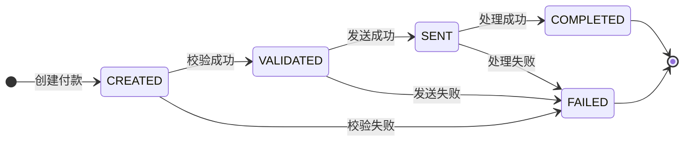

# Payment Processing System - Payment State Flow

> Source of truth: if any detail conflicts with iteration docs, follow `docs/iteration1/02-backend-method-design.md` and `docs/iteration1/03-interface-contracts.md`.

## 1. 文档说明

本文档描述 Payment Processing System 中付款（Payment）的生命周期状态流转规则。

系统通过状态管理来跟踪一笔付款从创建、校验、发送，到最终完成或失败的全过程。

核心目标：

- 明确付款有哪些状态；
- 定义状态之间允许的转换关系；
- 防止非法状态变化；
- 为后续 Java 状态机实现提供设计依据。

---

# 2. 付款生命周期流程图



---

# 3. 状态定义

## CREATED（已创建）

说明：

付款请求已经提交，并且已经保存到系统数据库。

此时付款还没有完成业务校验。

进入条件：

- 用户成功提交付款请求；
- 系统生成 Payment ID；
- 系统保存付款记录。

示例：

```
用户提交付款
        ↓
Payment 创建成功
        ↓
状态 = CREATED
```

---

## VALIDATED（已校验）

说明：

付款已经通过系统业务规则检查，可以继续处理。

校验内容包括：

- 金额是否合法；
- 币种是否支持；
- 来源账户和目标账户是否有效；
- 来源账户和目标账户不能相同。

进入条件：

```
CREATED
   |
   | validation passed
   ↓
VALIDATED
```

---

## SENT（已发送）

说明：

付款已经发送到目标处理系统。

本项目中不连接真实银行网络，因此使用系统内部模拟发送。

进入条件：

```
VALIDATED
   |
   | send payment
   ↓
SENT
```

---

## COMPLETED（已完成）

说明：

付款已经成功处理。

这是付款生命周期中的最终成功状态。

进入条件：

```
SENT
   |
   | processing confirmed
   ↓
COMPLETED
```

规则：

- COMPLETED 状态不能再改变；
- 不能返回 CREATED、VALIDATED 或 SENT。

---

## FAILED（失败）

说明：

付款在处理过程中的任意阶段失败。

可能发生的位置：

- 创建后校验失败；
- 发送失败；
- 最终处理失败。

失败时需要记录：

- errorCode；
- errorMessage；
- failure timestamp。

示例：

```
CREATED
   |
   | invalid amount
   ↓
FAILED
```

---

# 4. 合法状态转换规则

| 当前状态 | 可转换状态 | 说明 |
|---|---|---|
| CREATED | VALIDATED | 校验通过 |
| CREATED | FAILED | 校验失败 |
| VALIDATED | SENT | 发送成功 |
| VALIDATED | FAILED | 发送失败 |
| SENT | COMPLETED | 处理完成 |
| SENT | FAILED | 处理失败 |
| COMPLETED | 无 | 最终成功状态 |
| FAILED | 无 | 最终失败状态 |

---

# 5. 非法状态转换

以下状态变化必须被系统拒绝：

| 非法转换 | 原因 |
|---|---|
| CREATED → COMPLETED | 跳过校验和发送阶段 |
| CREATED → SENT | 未经过验证 |
| VALIDATED → COMPLETED | 跳过发送阶段 |
| SENT → CREATED | 状态不能回退 |
| SENT → VALIDATED | 状态不能回退 |
| COMPLETED → CREATED | 已完成付款不能重新开始 |
| COMPLETED → FAILED | 完成状态不能改变 |
| FAILED → SENT | 失败付款不能继续处理 |

---

# 6. 状态变化规则

所有状态变化必须满足以下要求：

## 6.1 状态不能随意修改

系统不允许用户直接修改 Payment Status。

例如：

错误方式：

```
PUT /api/payments/123

{
    "status": "COMPLETED"
}
```

正确方式：

```
POST /api/payments/123/process
```

由系统业务逻辑决定下一状态。

---

## 6.2 每次状态变化必须记录历史

每一次状态变化需要保存：

| 字段 | 说明 |
|---|---|
| paymentId | 对应付款 ID |
| fromStatus | 原状态 |
| toStatus | 新状态 |
| changedAt | 变化时间 |
| triggeredBy | 触发来源 |
| notes | 备注 |
| errorCode | 错误码（如果失败） |

示例：

```
CREATED
    |
    | SYSTEM
    | Validation passed
    ↓
VALIDATED
```

历史记录：

```
fromStatus:
CREATED

toStatus:
VALIDATED

triggeredBy:
SYSTEM

notes:
Validation passed
```

---

# 7. 状态机设计原则

## 原则 1：状态只能向前推进

付款流程：

```
CREATED
   ↓
VALIDATED
   ↓
SENT
   ↓
COMPLETED
```

不能反向：

```
COMPLETED
    ↓
CREATED
```

---

## 原则 2：最终状态不可修改

最终状态：

```
COMPLETED
FAILED
```

进入最终状态后：

- 不允许继续处理；
- 不允许改变状态；
- 如果需要撤销，应创建新的业务流程。

---

## 原则 3：失败必须可追踪

FAILED 状态必须包含：

```
errorCode
errorMessage
failedTime
```

例如：

```
Status:
FAILED

Error Code:
INVALID_AMOUNT

Message:
Payment amount must be greater than zero
```

---

# 8. Java 实现参考

后续实现时，可以使用 Enum 表示状态：

```text
PaymentStatus

CREATED
VALIDATED
SENT
COMPLETED
FAILED
```

状态转换逻辑：

```text
CREATED:
    VALIDATED
    FAILED

VALIDATED:
    SENT
    FAILED

SENT:
    COMPLETED
    FAILED

COMPLETED:
    NONE

FAILED:
    NONE
```

---

# 9. 测试场景

## 正常流程

测试：

```
CREATED
   ↓
VALIDATED
   ↓
SENT
   ↓
COMPLETED
```

预期：

付款成功完成。

---

## 校验失败

测试：

```
CREATED
   ↓
FAILED
```

场景：

- 金额为 0；
- 金额为负数；
- 不支持币种。

---

## 非法状态变化

测试：

```
COMPLETED
    ↓
CREATED
```

预期：

系统返回：

```
INVALID_STATUS_TRANSITION
```

---

# 10. 总结

Payment Processing System 的核心状态流程：

```
CREATED
    |
    v
VALIDATED
    |
    v
SENT
    |
    v
COMPLETED
```

任何阶段发生错误：

```
CREATED / VALIDATED / SENT
              |
              v
           FAILED
```

COMPLETED 和 FAILED 是最终状态，不能继续流转。
